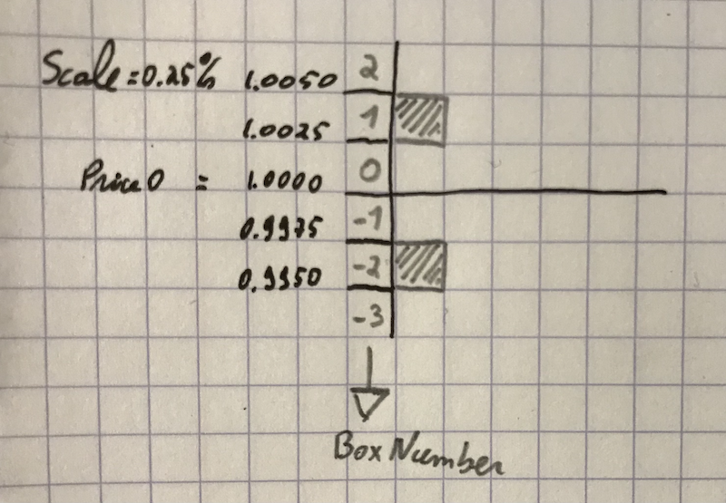
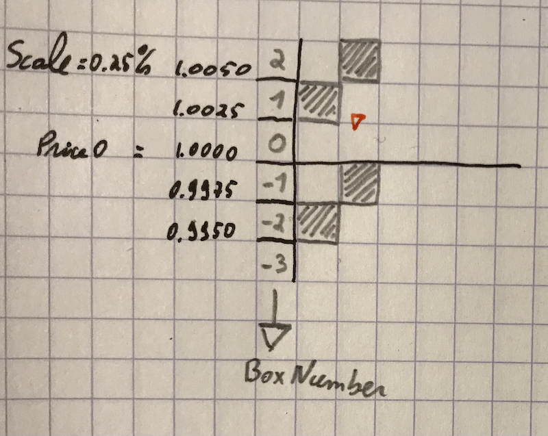

# Hedging Strategies and Management

An Hedge is a strategy to protect against Forex risk. Static hedges have for purpose to exactly counter balance the forex risk on another contract. Dynamic Hedges have for purpose to look to yield some profit, allowing a certain level of loss.

## Static Hedge

A static hedge is just a position that is taken and not changed until removed.

A Short 10,000 Units position is represented by:

```
{"Size":-10000}
```

A Long 7,345 Units position:

```
{"Size": 7345}
```

### Adding a Static Hedge to the Inventory of Hedges:

```
curl -data '{"Size": -10000}' localhost:8080/hedge/static
```

## Dynamic Hedge

A Dynamic Hedge is a position variable in size with price fluctuations.

### Initialisation Parameters:

- ***Scale***: the percentage change of price to trigger one variation of the position **Size**
- ***Size0***: number of units to trade on a price change of ***Scale*** percents

A dynamic hedge trading 2000 units for each 0.25% price jump is added with the call:

```
curl -data '{"Size0": 2000, "Scale": 0.25}' localhost:8080/hedge/dynamic
```

On the first tick, the dynamic hedge is initialised:

- ***Price0*** is set as the tick price, it is the activation price. Positions will be *Short* above that level, and *Long* below.

Imagine the initialisation price is 1.0000, **Price0** is set at 1.0000. Price boxes are defined and numbered as show in the figure below:


*Boxes with price thresholds and corresponding order.*


The Size of the hedge remains 0 for any price fluctuation within Box # -1 and Box # 0 (0.9975 - 1.0025 price range).

The ***BoxUp*** parameter is set at 1, and corresponds to the price range 1.0025 - 1.0050.

The ***BoxDown*** parameter is set at -2, and corresponds to the price range 0.9975 - 0.9950.

### The dynamic process

The dynamic trading occurs when the price hits the ***BoxUp*** or ***BoxDown***.


In the example below, the price rises above 1.0025, entering ***BoxUp***. The system will do the following:

- Sell 2000 Units
- Rise ***BoxUp*** to number 2, ( 1.0050 - 1.0075 range)
- Rise ***BoxDown*** to number 0 (1.0000 - 1.0025 range)


This is illustrated in the following figure:


*Price touched BoxUp, 2000 units are sold, and boundary boxes are raised.*

And the process is repeated, selling 2000 when ***BoxUp*** is hit, rising ***BoxUp*** and ***BoxDown***. And conversely buying 2000 when ***BoxDown*** is hit, lowering ***BoxUp*** and ***BoxDown***.

Two parameters are used to count the number of steps up and down (***LengthUp*** and ***LengthDown***).

### Risk-Reward of the dynamic process

As price drifts away from ***Price0***, the size of the position will grow, and unrealised losses as well. In order to clearly understand the risk profile, consider the following:

#### Risk

If **N** = ***LengthUp*** - ***LengthDown*** is the number of boxes moves away from ***Price0***:

***Size*** = - ***Size0*** * ***N***

(positive for a price movement down and negative for a price movement up)

The accumulated unrealised PL is:

***PL*** = -(***N*** * ***N*** + ***N***)/2  ***Size0*** * ***Scale*** / 100

In the example above, if ***N*** = 10 (2.5% price change):

***Size*** = ***-10,000 Units***

***PL*** = (100 + 10) / 2 * 2000 * 0.25 / 100 = ***-275 Units***

#### Reward

Each time a move up is compensated with a move down (no matter the order), a small profit is generated equals to ***Size0*** * ***Scale*** / 100.

The number of such box move reversal is:

***Np*** = max(***LengthUp***, ***LengthDown***) - abs(***LengthUp*** - ***LengthDown***)

And the realised profit is:

***Np*** * ***Size0*** * ***Scale*** / 100

In the previous example, if ***LengthUp*** = 20 and ***LengthDown*** = 10:

***Np*** = 10

and the profit is: 10 * 2000 * 0.25 / 100 = 50 Units

We see that more fluctuations or a deeper reversal is required to get an overall profit.

The rationale is that over the long run, ***N*** grows slower than ***Np***, thus if the ***Size0*** and ***Scale*** parameter combination is well chosen to avoid excessive risk (and margin calls), the strategy will ultimately be profitable.

## Removing Hedges

There is no ID for Hedges in the Inventory, and no endpoint to remove Hedges.

The procedure is to save the Inventory in a file, and edit to remove the hedges to decommission, then stop and restart the server with the new inventory state.
